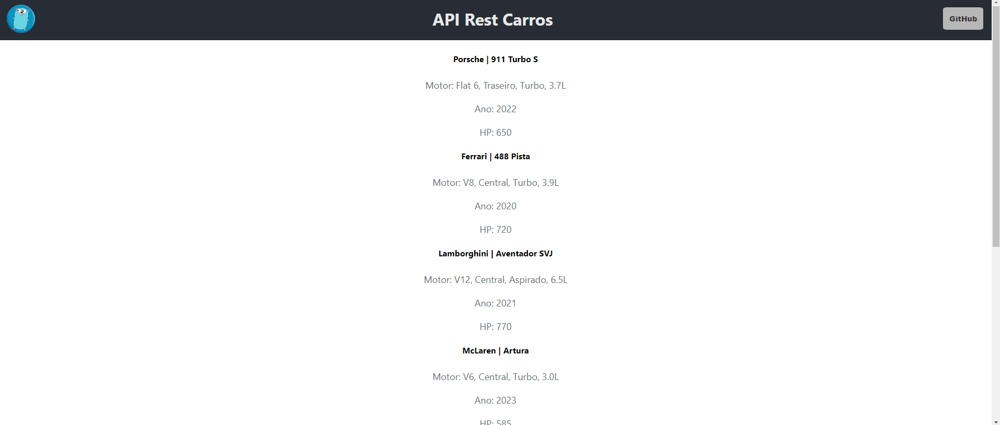

<h1 align="center">API Rest Carros</h1>

***
<p align="center">
  <a href="https://www.linkedin.com/in/matheusdeperez/"></a>
  <a href="mailto:matheus.mperez08@gmail.com"></a>
</p>

<p align="center">  

⭐ Esse é um projeto para demonstrar meu conhecimento técnico no desenvolvimento fullstack com React (TypeScript) para o front-end e GoLang para o back-end. Mais informações técnicas abaixo.

🎥 Essa é uma aplicação que fornece uma lista de carros com algumas informações simples, podendo ler, atualizar, escrever e deletar dados através das requisições API.

</p>

<br>

<p float="left" align="center">

  

</p>

## Como utilizar

***

 - Rode o comando na pasta raiz:
```go run main.go```<br><br>

 - Na pasta **front-go**, rode oos comandos: <br> 
```npm update```<br>
```npm start```

## Tecnologias usadas e bibliotecas de código aberto

- [Linguagem Go](https://go.dev/)


- Bibliotecas
    - [React com Typescript](https://beta.reactjs.org/): Para fazer o front-end da aplicação.
    - [HTTP server](https://gobyexample.com/http-servers): Usada para fornecer recursos dinâmicos de web.
    - [gorilla/mux](https://github.com/gorilla/mux): Gerenciamento de rotas e requisições http.
    - [PostgreSQL](https://www.postgresql.org/): Banco de dados relacional.
    - [Middleware](https://gowebexamples.com/basic-middleware/): Usado para adicionar comportamentos ao fluxo de requisições API.
    - [Axios](https://www.npmjs.com/package/axios): Requisições API no React.
    - [Styled Components](https://styled-components.com/): Estilização de componentes React.
    - [...]